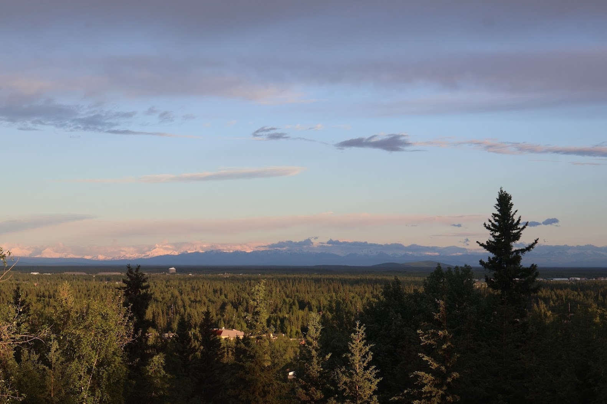

{fig-align="left"}

**NRM 692 / 497 · Thursdays, 11:30–12:30 p.m. · Elvey Auditorium · Fall 2026**

Join the Department of Natural Resources and Environment for a public seminar series highlighting new research and real-world challenges in the boreal forest. Come hear speakers share their work on wildfire and forest resilience, carbon cycling and climate change, wildlife and habitat dynamics, permafrost and ecosystem change, and more.

**2026 Theme: Boreal Ecosystems**

A department seminar series accomplishes two goals: 1) to expose faculty and students to a wide range of natural resource research that may stimulate new perspective, research directions and potential collaborations, and 2) to promote and share research within the department with visiting researchers. A seminar series works best when the entire departmental community regularly participates. This course encourages this participation, with a little extra structure to practice absorbing and synthesizing the context, evaluating the research and the delivery, and conveying your research interests and ideas to seminar speakers in a one-on-one or group context.

This seminar series is open to the public and offered for 1 credit with a remote option. Contact Dr. Kate Hayes ([khayes23\@alaska.edu](mailto:khayes23@alaska.edu)) for more information.
